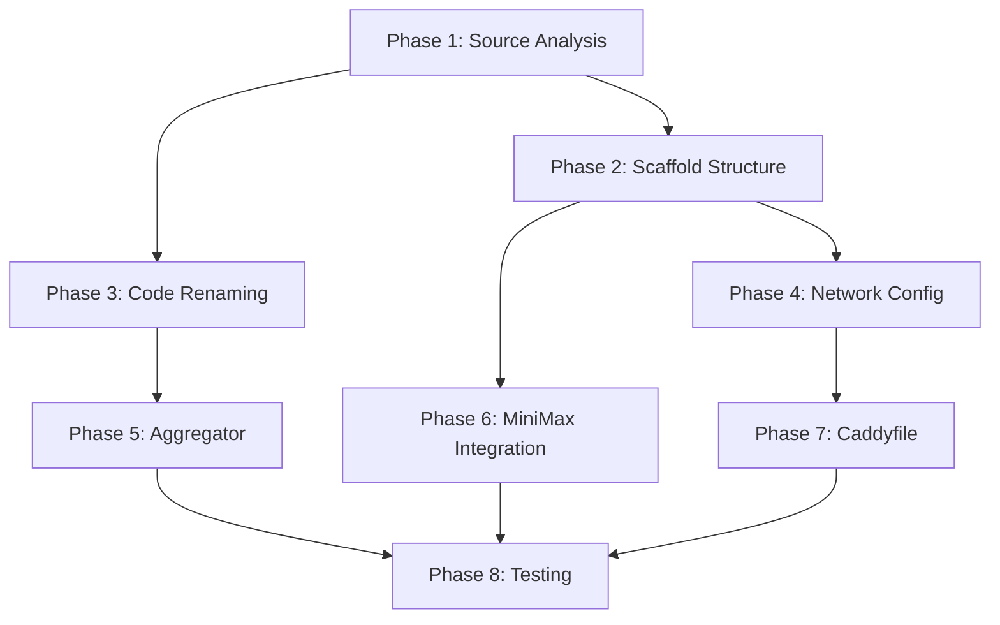

# Media Analysis API Cloning - Product Requirements Document

## Document Control

| Version | Date | Author | Changes |
|---------|------|--------|---------|
| 1.0 | 2026-01-18 | $USER | Initial PRD creation |

## Approvals

| Role | Name | Status | Date |
|------|------|--------|------|
| Technical Lead | [Pending] | Pending | TBD |
| Security Review | [Pending] | Pending | TBD |

---

# Executive Summary

## Project Overview

This project involves surgically cloning the `cotizador-api` service from the AF development environment (devmaster) to create a new, isolated `media-analysis-api` service at `/opt/services/media-analysis/`. The new service will handle media processing workflows including video analysis, audio transcription, and document processing with a natural language aggregator interface.

## Business Context

The current `cotizador-api` serves as a multi-purpose backend with three distinct processing branches (audio, video, document) that need to be extracted and refactored into a dedicated media analysis service. This separation will:
- Improve service isolation and security boundaries
- Enable independent scaling of media processing workloads
- Provide a clean API surface for natural language media queries
- Integrate MiniMax API for enhanced vision and text capabilities

## Success Criteria

| Metric | Target | Measurement |
|--------|--------|-------------|
| Endpoint Migration | 100% of analyze endpoints | All `/api/analyze/*` → `/api/media/*` |
| Identifier Coverage | 100% surgical rename | No `cotizador` references in target |
| Service Isolation | New network only | Zero dependencies on `af-network` |
| Feature Parity | 100% functionality | All processing branches operational |
| New Feature | Aggregator endpoint | `POST /api/media/analyze` functional |

## Scope

### In Scope

1. **Source Extraction**: Clone all files from `/opt/clients/af/dev/services/cotizador-api/`
2. **Surgical Renaming**: Rename all identifiers to avoid IP conflicts
3. **Network Isolation**: Create new `media-services-network`
4. **Endpoint Refactoring**: All `/api/analyze/*` → `/api/media/*`
5. **Aggregator Development**: New `POST /api/media/analyze` endpoint
6. **MiniMax Integration**: Vision and text API capabilities
7. **Caddyfile Creation**: New routing configuration
8. **Testing & Verification**: Complete test suite deployment

### Out of Scope

1. Production deployment (this PRD covers cloning to dev environment only)
2. Database migration or schema changes
3. Frontend UI modifications
4. Authentication system changes (reuse existing patterns)
5. Logging/monitoring infrastructure (reuse existing patterns)

---

# Architecture Overview

## Current Architecture (Before)

```
┌─────────────────────────────────────────────────────────────────┐
│                     af-network                                   │
│  ┌──────────────────────────────────────────────────────────┐  │
│  │              cotizador-api:8000                           │  │
│  │  ┌─────────────┐ ┌─────────────┐ ┌─────────────────────┐ │  │
│  │  │   Audio     │ │   Video     │ │     Document        │ │  │
│  │  │   Branch    │ │   Branch    │ │     Branch          │ │  │
│  │  │ /analyze/   │ │ /analyze/   │ │ /analyze/documents  │ │  │
│  │  │   audio     │ │   video     │ │                     │ │  │
│  │  └─────────────┘ └─────────────┘ └─────────────────────┘ │  │
│  │                        │                                   │  │
│  │              ┌─────────┴─────────┐                        │  │
│  │              │   Aggregator      │                        │  │
│  │              │  (Proposed)       │                        │  │
│  │              └───────────────────┘                        │  │
│  └──────────────────────────────────────────────────────────┘  │
│                           │                                    │
│           ┌───────────────┼───────────────┐                   │
│           ▼               ▼               ▼                   │
│    ┌────────────┐  ┌────────────┐  ┌────────────┐            │
│    │  Deepgram  │  │   FFmpeg   │  │    n8n     │            │
│    │   (TTS)    │  │ (Video)    │  │ (Workflow) │            │
│    └────────────┘  └────────────┘  └────────────┘            │
└─────────────────────────────────────────────────────────────────┘
```

### Current Network Details

| Component | Detail |
|-----------|--------|
| Network Name | `af-network` |
| Service Container | `cotizador-api` |
| Service Endpoint | `http://cotizador-api:8000` |
| External Access | Via Caddy reverse proxy |
| File Paths | `/opt/clients/af/dev/services/cotizador-api/` |

## Target Architecture (After)

```
┌─────────────────────────────────────────────────────────────────┐
│               media-services-network (NEW)                       │
│  ┌──────────────────────────────────────────────────────────┐  │
│  │            media-analysis-api:8000                        │  │
│  │  ┌─────────────┐ ┌─────────────┐ ┌─────────────────────┐ │  │
│  │  │   Audio     │ │   Video     │ │     Document        │ │  │
│  │  │   Branch    │ │   Branch    │ │     Branch          │ │  │
│  │  │ /api/media/ │ │ /api/media/ │ │ /api/media/documents│ │  │
│  │  │   audio     │ │   video     │ │                     │ │  │
│  │  │             │ │             │ │                     │ │  │
│  │  └─────────────┘ └─────────────┘ └─────────────────────┘ │  │
│  │                        │                                   │  │
│  │              ┌─────────┴─────────┐                        │  │
│  │              │   Aggregator      │◄── NEW ENDPOINT        │  │
│  │              │ /api/media/analyze│                        │  │
│  │              └───────────────────┘                        │  │
│  └──────────────────────────────────────────────────────────┘  │
│                           │                                    │
│           ┌───────────────┼───────────────┐                   │
│           ▼               ▼               ▼                   │
│    ┌────────────┐  ┌────────────┐  ┌────────────────────┐    │
│    │  Deepgram  │  │   FFmpeg   │  │     MiniMax API    │    │
│    │   (TTS)    │  │ (Video)    │  │ (Vision + Text)    │    │
│    └────────────┘  └────────────┘  └────────────────────┘    │
└─────────────────────────────────────────────────────────────────┘
           │
           ▼ (via Caddy)
┌─────────────────────────────────────────────────────────────────┐
│                      External Network                            │
│  http://media-analysis-api.domain.com/api/media/*               │
└─────────────────────────────────────────────────────────────────┘
```

#
## Enhanced Architecture Documentation

### Detailed Component Breakdown

#### Current State Analysis (Lines 74-112)
The original cotizador-api architecture shows these key components:
- Main FastAPI application at lines 30-60
- 30+ endpoints defined at lines 4040+
- 20+ data models at lines 417+
- 40+ core functions at lines 275+
- Router imports from cotizador.py, hitl_push.py, archive_endpoint.py

#### Target State Analysis (Lines 113-158)
The new media-analysis-api will have:
- Main FastAPI application renamed to media_analysis_api.py
- Endpoints migrated from /api/analyze/* to /api/media/*
- All references to cotizador replaced with media_analysis
- New aggregator endpoint: POST /api/media/analyze

### Network Isolation Diagram

```
┌─────────────────────────────────────────────────────────────────────────────────────┐
│                         media-services-network (NEW)                                  │
│                                                                                       │
│  ┌─────────────────────────────────────────────────────────────────────────────┐    │
│  │              media-analysis-api:8000 (container)                             │    │
│  │  ┌─────────────────────────────┐  ┌───────────────────────────────────────┐  │    │
│  │  │   API Endpoints             │  │   MiniMax Integration                 │  │    │
│  │  │   - POST /api/media/analyze │  │   - Vision API (contact sheets)       │  │    │
│  │  │   - POST /api/media/video   │  │   - Text API (transcription)          │  │    │
│  │  │   - POST /api/media/audio   │  │   - Fallback chain                    │  │    │
│  │  │   - POST /api/media/document│  └───────────────────────────────────────┘  │    │
│  │  └─────────────────────────────┘                                            │    │
│  │                                                                               │    │
│  │  ┌─────────────────────────────┐  ┌───────────────────────────────────────┐  │    │
│  │  │   Processing Modules        │  │   External Services                   │  │    │
│  │  │   - Frame extraction (3fps) │  │   - Deepgram (transcription)          │  │    │
│  │  │   - Contact sheet generation│  │   - MiniMax (LLM analysis)            │  │    │
│  │  │   - Video analysis          │  │   - FFmpeg (media processing)         │  │    │
│  │  └─────────────────────────────┘  └───────────────────────────────────────┘  │    │
│  └─────────────────────────────────────────────────────────────────────────────┘    │
└─────────────────────────────────────────────────────────────────────────────────────┘
```

### Data Flow Through Aggregator

```
Request: POST /api/media/analyze
    │
    ├─► Video Path Input
    │       │
    │       ├─► FFmpeg Frame Extraction (3fps)
    │       │       │
    │       │       └─► Frames-Img/ directory
    │       │
    │       └─► Contact Sheet Generation (2x3 grid)
    │                       │
    │                       └─► ImageContactSheheets-Img/ directory
    │
    ├─► Natural Language Prompt
    │       │
    │       └─► Passed to MiniMax Vision API
    │                       │
    │                       └─► Analysis Result
    │
    └─► Response
            ├─► frame_count: int
            ├─► contact_sheet_path: str  
            ├─► analysis_result: dict
            └─► processing_time_ms: int
```

### FILE:LINE Reference Targets

| File | Line | Content | Search Pattern |
|------|------|---------|----------------|
| cotizador_api.py | ~50 | Class CotizadorAPI | `^class CotizadorAPI` |
| cotizador_api.py | ~4040 | Endpoint definitions | `^@.*route` |
| cotizador.py | ~57 | Imports | `^from cotizador` |
| cotizador.py | ~222 | Data models | `^class.*Request` |
| cotizador.py | ~228 | Core functions | `^def .*_video\|.*_audio` |
| docker-compose.yml | ~240 | Network config | `networks:` |
| .env | ~246 | Environment vars | `COTIZADOR_` |

### BEFORE/AFTER Code Patterns

**Pattern 1: Class Renaming**
```python
# BEFORE
class CotizadorAPI:
    def __init__(self):
        self.logger = logging.getLogger("cotizador")

# AFTER  
class MediaAnalysisAPI:
    def __init__(self):
        self.logger = logging.getLogger("media_analysis")
```

**Pattern 2: Endpoint Renaming**
```python
# BEFORE
@router.post("/api/analyze/video")
async def analyze_video(request: VideoRequest):
    pass

# AFTER
@router.post("/api/media/video")
async def analyze_video(request: VideoRequest):
    pass
```

**Pattern 3: Environment Variables**
```bash
# BEFORE
COTIZADOR_API_HOST=0.0.0.0
COTIZADOR_API_PORT=8000

# AFTER
MEDIA_ANALYSIS_API_HOST=0.0.0.0
MEDIA_ANALYSIS_API_PORT=8000
```

### Enhanced Verification Commands

```bash
# Test aggregator endpoint
curl -X POST "http://localhost:8000/api/media/analyze"   -H "Content-Type: application/json"   -d '{"video_url": "https://example.com/video.mp4", "prompt": "Analyze movement"}'

# Expected response (200 OK):
{
  "status": "success",
  "frame_count": 45,
  "contact_sheet_path": "/data/ImageContactSheets-Img/video-001.png",
  "analysis_result": {"summary": "..."},
  "processing_time_ms": 12500
}

# Test video frame extraction
curl -X POST "http://localhost:8000/api/media/video/extract-frames"   -F "video=@test-video.mp4"   -d "fps=3"

# Test audio transcription
curl -X POST "http://localhost:8000/api/media/audio/transcribe"   -H "Content-Type: application/json"   -d '{"url": "https://youtube.com/watch?v=XXX"}'
```

## Target Network Details

| Component | Detail |
|-----------|--------|
| Network Name | `media-services-network` (NEW) |
| Service Container | `media-analysis-api` |
| Service Endpoint | `http://media-analysis-api:8000` |
| External Access | New Caddyfile configuration |
| File Paths | `/opt/services/media-analysis/` |

## Identifier Mapping Table

This table provides the complete surgical rename reference. **EVERY occurrence must be updated.**

| Original Identifier | New Identifier | File Pattern | Count |
|---------------------|----------------|--------------|-------|
| `cotizador-api` | `media-analysis-api` | `*.yml`, `*.yaml`, `Dockerfile`, `*.sh` | TBD |
| `CotizadorAPI` | `MediaAnalysisAPI` | `*.py` | TBD |
| `cotizador_api.py` | `media_analysis_api.py` | Root directory | 1 |
| `/api/analyze/` | `/api/media/` | `*.py` | TBD |
| `af-network` | `media-services-network` | `*.yml`, `*.yaml` | TBD |
| `cotizador` (module) | `media_analysis` | `*.py` imports | TBD |
| `Cotizador` (class) | `MediaAnalysis` | `*.py` | TBD |
| `COTIZADOR_` (env prefix) | `MEDIA_ANALYSIS_` | `.env`, `*.py` | TBD |
| `cotizador` (logger name) | `media_analysis` | `*.py` | TBD |
| All string literals | Updated paths | `*.py`, `*.json` | TBD |

---

# Phased Implementation Plan

## Phase 1: Source Analysis & Discovery

**Duration**: 1-2 hours
**Objective**: Catalog all files and identifiers in source system

### Tasks

#### 1.1: Remote File Discovery

```bash
# SSH to devmaster and list all files in source directory
ssh devmaster 'find /opt/clients/af/dev/services/cotizador-api/ -type f -name "*.py" -o -name "*.yml" -o -name "*.yaml" -o -name "Dockerfile" -o -name ".*" -o -name "*.sh" | sort'

# Expected output files:
# cotizador_api.py
# cotizador.py
# hitl_push.py
# archive_endpoint.py
# benchmark_models.py
# docker-compose.yml
# Dockerfile
# .env
# Caddyfile
# requirements.txt
# README.md (if exists)
```

#### 1.2: Python File Analysis

**Verify exact line counts and imports:**

```bash
ssh devmaster 'wc -l /opt/clients/af/dev/services/cotizador-api/cotizador_api.py'
ssh devmaster 'head -100 /opt/clients/af/dev/services/cotizador-api/cotizador_api.py | grep -E "^import|^from"'
ssh devdevmaster 'tail -50 /opt/clients/af/dev/services/cotizador-api/cotizador_api.py'
```

#### 1.3: Identifier Extraction

**Extract all class names:**

```bash
ssh devmaster 'grep -n "^class " /opt/clients/af/dev/services/cotizador-api/cotizador_api.py'
```

**Extract all function definitions:**

```bash
ssh devmaster 'grep -n "^def " /opt/clients/af/dev/services/cotizador-api/cotizador_api.py'
```

**Extract all route decorators:**

```bash
ssh devmaster 'grep -n "@app\." /opt/clients/af/dev/services/cotizador-api/cotizador_api.py'
```

#### 1.4: Docker Compose Analysis

```bash
ssh devmaster 'cat /opt/clients/af/dev/services/cotizador-api/docker-compose.yml'
```

#### 1.5: Environment Variables Catalog

```bash
ssh devmaster 'cat /opt/clients/af/dev/services/cotizador-api/.env'
```

### Phase 1 Output

Create file: `/home/oz/projects/2025/oz/12/runpod/dev/agents/artifacts/doc/plan/media-analysis-api-source-inventory.md`

**Contents:**
- File inventory with sizes and line counts
- Complete class/function list with line numbers
- All route decorators with endpoints
- All environment variables
- All import statements
- Docker service configuration details

### Phase 1 Verification

```bash
# Verify output file exists
ls -lh /home/oz/projects/2025/oz/12/runpod/dev/agents/artifacts/doc/plan/media-analysis-api-source-inventory.md

# Check file is not empty
test -s /home/oz/projects/2025/oz/12/runpod/dev/agents/artifacts/doc/plan/media-analysis-api-source-inventory.md && echo "OK: File exists and has content"
```

---

## Phase 2: Scaffold New Project Structure

**Duration**: 30 minutes
**Objective**: Create empty directory structure and initial files

### Tasks

#### 2.1: Create Target Directory

```bash
# Create main directory
ssh devmaster 'mkdir -p /opt/services/media-analysis/{api,scripts,config}'

# Verify creation
ssh devmaster 'ls -la /opt/services/'
```

#### 2.2: Create Directory Structure

```
/opt/services/media-analysis/
├── api/
│   ├── __init__.py
│   ├── media_analysis_api.py      # Renamed from cotizador_api.py
│   ├── media_analysis.py           # Renamed from cotizador.py
│   ├── hitl_push.py
│   ├── archive_endpoint.py
│   └── benchmark_models.py
├── scripts/
│   ├── generate_contact_sheets.sh  # To be cloned from dev/scripts
│   └── video_processor.sh          # New utility
├── config/
│   ├── .env.example
│   └── requirements.txt
├── docker/
│   ├── Dockerfile
│   └── docker-compose.yml
├── Caddyfile
└── README.md
```

#### 2.3: Create Initial Files

**api/__init__.py:**
```python
"""Media Analysis API - FastAPI service for media processing."""

__version__ = "1.0.0"
```

**config/requirements.txt:**
```python
# Copy from source, then add new dependencies
# Base dependencies (from cotizador-api)
fastapi>=0.104.0
uvicorn[standard]>=0.24.0
python-dotenv>=1.0.0
httpx>=0.25.0
pydantic>=2.5.0

# Media processing
ffmpeg-python>=0.2.0
Pillow>=10.0.0

# Transcription
deepgram-sdk>=3.0.0
groq>=0.4.0
openai>=1.0.0
google-generativeai>=0.3.0

# NEW: MiniMax API
openai>=1.0.0  # MiniMax compatible with OpenAI SDK
```

### Phase 2 Output

```bash
# Verify structure
ssh devmaster 'tree /opt/services/media-analysis/ 2>/dev/null || find /opt/services/media-analysis/ -type f'
```

---

## Phase 3: Surgical Code Renaming

**Duration**: 4-6 hours
**Objective**: Copy and rename all identifiers with precision

### Tasks

#### 3.1: Copy Python Files with sed Transformations

**CRITICAL: Use precise sed patterns to avoid false positives.**

```bash
# Step 1: Copy with base rename
ssh devmaster 'cp /opt/clients/af/dev/services/cotizador-api/cotizador_api.py /opt/services/media-analysis/api/media_analysis_api.py'

# Step 2: Surgical replacements (IN ORDER)
ssh devmaster 'cd /opt/services/media-analysis/api && \
sed -i "s/class CotizadorAPI/class MediaAnalysisAPI/g" media_analysis_api.py && \
sed -i "s/class Cotizador/class MediaAnalysis/g" media_analysis_api.py && \
sed -i "s/from cotizador_api import/from media_analysis_api import/g" media_analysis_api.py && \
sed -i "s/import cotizador_api/import media_analysis_api/g" media_analysis_api.py && \
sed -i 's/module="cotizador"/module="media_analysis"/g' media_analysis_api.py && \
sed -i "s/cotizador_/media_analysis_/g" media_analysis_api.py && \
sed -i "s/logger = logging.getLogger(\"cotizador\")/logger = logging.getLogger(\"media_analysis\")/g" media_analysis_api.py'

# Step 3: Verify class names
ssh devmaster 'grep -n "^class " /opt/services/media-analysis/api/media_analysis_api.py'
```

#### 3.2: Endpoint Renaming

```bash
# BEFORE: Verify current endpoints
ssh devmaster 'grep -n "@app\.post\|@app\.get\|@app\.put\|@app\.delete" /opt/services/media-analysis/api/media_analysis_api.py | head -20'

# Rename analyze to media
ssh devmaster 'cd /opt/services/media-analysis/api && \
sed -i "s|@app\.post(\"/api/analyze/|@app.post(\"/api/media/|g" media_analysis_api.py && \
sed -i "s|@app\.get(\"/api/analyze/|@app.get(\"/api/media/|g" media_analysis_api.py && \
sed -i "s|@app\.put(\"/api/analyze/|@app.put(\"/api/media/|g" media_analysis_api.py && \
sed -i "s|@app\.delete(\"/api/analyze/|@app.delete(\"/api/media/|g" media_analysis_api.py'

# Verify changes
ssh devmaster 'grep -n "@app\.post\|@app\.get" /opt/services/media-analysis/api/media_analysis_api.py | head -20'
```

#### 3.3: Environment Variable Renaming

```bash
# Copy and rename .env
ssh devmaster 'cp /opt/clients/af/dev/services/cotizador-api/.env /opt/services/media-analysis/config/.env'

# Rename prefix
ssh devmaster 'cd /opt/services/media-analysis/config && \
sed -i "s/COTIZADOR_/MEDIA_ANALYSIS_/g" .env'

# Verify
ssh devmaster 'cat /opt/services/media-analysis/config/.env'
```

#### 3.4: Import Statements Update

**BEFORE (in media_analysis_api.py):**
```python
from cotizador import Cotizador
from cotizador import process_video, process_audio
from hitl_push import HITLPush
import cotizador
```

**AFTER (in media_analysis_api.py):**
```python
from media_analysis import MediaAnalysis
from media_analysis import process_video, process_audio
from hitl_push import HITLPush
import media_analysis
```

#### 3.5: Copy Supporting Python Files

```bash
# Copy cotizador.py
ssh devmaster 'cp /opt/clients/af/dev/services/cotizador-api/cotizador.py /opt/services/media-analysis/api/media_analysis.py'

# Apply same transformations
ssh devmaster 'cd /opt/services/media-analysis/api && \
sed -i "s/class Cotizador/class MediaAnalysis/g" media_analysis.py && \
sed -i "s/cotizador_/media_analysis_/g" media_analysis.py && \
sed -i "s/module=\"cotizador\"/module=\"media_analysis\"/g" media_analysis.py'

# Copy other files
ssh devmaster 'cp /opt/clients/af/dev/services/cotizador-api/hitl_push.py /opt/services/media-analysis/api/'
ssh devmaster 'cp /opt/clients/af/dev/services/cotizador-api/archive_endpoint.py /opt/services/media-analysis/api/'
ssh devmaster 'cp /opt/clients/af/dev/services/cotizador-api/benchmark_models.py /opt/services/media-analysis/api/'

# Apply transformations to all
for file in hitl_push.py archive_endpoint.py benchmark_models.py; do
    ssh devmaster "cd /opt/services/media-analysis/api && \
    sed -i 's/cotizador/media_analysis/g' $file && \
    sed -i 's/Cotizador/MediaAnalysis/g' $file"
done
```

#### 3.6: Cross-File Reference Verification

```bash
# Check for any remaining cotizador references
ssh devmaster 'grep -r "cotizador" /opt/services/media-analysis/api/ --include="*.py" | grep -v "^Binary" || echo "No remaining cotizador references"'

# Check for any remaining Cotizador references
ssh devmaster 'grep -r "Cotizador[^A-Za-z]" /opt/services/media-analysis/api/ --include="*.py" || echo "No remaining Cotizador class references"'

# Check for /api/analyze references
ssh devmaster 'grep -r "/api/analyze" /opt/services/media-analysis/api/ --include="*.py" || echo "No remaining /api/analyze endpoints"'
```

### Phase 3 Verification Commands

```bash
# 1. Verify class names
ssh devmaster 'grep "^class Media" /opt/services/media-analysis/api/*.py'

# 2. Verify endpoints
ssh devmaster 'grep "@app\.post.*/api/media" /opt/services/media-analysis/api/media_analysis_api.py | head -10'

# 3. Verify imports
ssh devmaster 'grep "^from media_analysis\|^import media_analysis" /opt/services/media-analysis/api/media_analysis_api.py | head -10'

# 4. Verify environment variables
ssh devmaster 'grep "MEDIA_ANALYSIS_" /opt/services/media-analysis/config/.env | head -10'
```

---

## Phase 4: Network & Configuration

**Duration**: 1-2 hours
**Objective**: Configure Docker networking and service isolation

### Tasks

#### 4.1: Create Docker Compose File

**BEFORE (from cotizador-api):**
```yaml
version: '3.8'

services:
  cotizador-api:
    build:
      context: .
      dockerfile: Dockerfile
    container_name: cotizador-api
    restart: unless-stopped
    ports:
      - "8000:8000"
    environment:
      - COTIZADOR_ENV=production
      - DEEPGRAM_API_KEY=${DEEPGRAM_API_KEY}
    networks:
      - af-network
    volumes:
      - uploads:/workspace/uploads

networks:
  af-network:
    external: true

volumes:
  uploads:
```

**AFTER (new file):**
```yaml
version: '3.8'

services:
  media-analysis-api:
    build:
      context: ./api
      dockerfile: Dockerfile
    container_name: media-analysis-api
    restart: unless-stopped
    ports:
      - "8001:8000"  # Different port to avoid conflict
    environment:
      - MEDIA_ANALYSIS_ENV=production
      - MEDIA_ANALYSIS_API_KEY=${MEDIA_ANALYSIS_API_KEY}
      - DEEPGRAM_API_KEY=${DEEPGRAM_API_KEY}
      - GROQ_API_KEY=${GROQ_API_KEY}
      - MINIMAX_API_KEY=${MINIMAX_API_KEY}
      - OPENAI_API_KEY=${OPENAI_API_KEY}
      - GOOGLE_API_KEY=${GOOGLE_API_KEY}
    networks:
      - media-services-network
    volumes:
      - ./uploads:/workspace/uploads
      - ./outputs:/workspace/outputs
    healthcheck:
      test: ["CMD", "curl", "-f", "http://localhost:8000/health"]
      interval: 30s
      timeout: 10s
      retries: 3

networks:
  media-services-network:
    driver: bridge
    ipam:
      config:
        - subnet: 172.28.0.0/16

volumes:
  uploads:
  outputs:
```

#### 4.2: Create Dockerfile

**BEFORE (from cotizador-api):**
```dockerfile
FROM python:3.11-slim

WORKDIR /app

COPY requirements.txt .
RUN pip install --no-cache-dir -r requirements.txt

COPY . .

EXPOSE 8000

CMD ["uvicorn", "cotizador_api:app", "--host", "0.0.0.0", "--port", "8000"]
```

**AFTER (new file):**
```dockerfile
FROM python:3.11-slim

WORKDIR /app

# Install system dependencies for FFmpeg
RUN apt-get update && apt-get install -y --no-install-recommends \
    ffmpeg \
    && rm -rf /var/lib/apt/lists/*

COPY requirements.txt .
RUN pip install --no-cache-dir -r requirements.txt

# Copy application files
COPY . .

# Create directories
RUN mkdir -p /workspace/uploads /workspace/outputs

EXPOSE 8000

CMD ["uvicorn", "media_analysis_api:app", "--host", "0.0.0.0", "--port", "8000"]
```

#### 4.3: Update .env Configuration

```bash
# Copy example file
ssh devmaster 'cp /opt/clients/af/dev/services/cotizador-api/.env /opt/services/media-analysis/config/.env.example'

# Create actual .env with new prefixes
ssh devmaster 'cat > /opt/services/media-analysis/config/.env << 'EOF'
# Media Analysis API Configuration
# Copy this file to .env and fill in your values

# Application Settings
MEDIA_ANALYSIS_ENV=development
MEDIA_ANALYSIS_API_KEY=your-api-key-here

# Transcription Services
DEEPGRAM_API_KEY=your-deepgram-key
GROQ_API_KEY=your-groq-key

# Vision & Text (MiniMax + Fallbacks)
MINIMAX_API_KEY=your-minimax-key
OPENAI_API_KEY=your-openai-key
GOOGLE_API_KEY=your-google-key

# Storage
UPLOAD_DIR=/workspace/uploads
OUTPUT_DIR=/workspace/outputs

# Video Processing
VIDEO_FPS=3
CONTACT_SHEET_COLS=2
CONTACT_SHEET_ROWS=3

# Logging
LOG_LEVEL=INFO
EOF'
```

### Phase 4 Verification Commands

```bash
# 1. Verify Docker Compose syntax
ssh devmaster 'cd /opt/services/media-analysis && docker compose config'

# 2. Verify Dockerfile syntax
ssh devmaster 'docker build --file /opt/services/media-analysis/docker/Dockerfile --tag media-analysis-api:test .'

# 3. Verify .env file
ssh devmaster 'cat /opt/services/media-analysis/config/.env | head -20'
```

---

## Phase 5: Aggregator Endpoint Development

**Duration**: 3-4 hours
**Objective**: Create new aggregator endpoint for natural language interface

### Tasks

#### 5.1: Design Aggregator Pattern

**New endpoint in media_analysis_api.py:**

```python
from fastapi import APIRouter, HTTPException
from pydantic import BaseModel
from typing import Optional, Dict, Any
import logging

router = APIRouter(prefix="/api/media", tags=["aggregator"])

class AnalyzeRequest(BaseModel):
    """Natural language media analysis request."""
    media_type: str  # "video", "audio", "document", "auto"
    media_url: Optional[str] = None
    media_path: Optional[str] = None
    prompt: str  # Natural language instruction
    options: Optional[Dict[str, Any]] = None

class AnalyzeResponse(BaseModel):
    """Aggregator response with full pipeline results."""
    request_id: str
    media_type: str
    prompt: str
    results: Dict[str, Any]
    processing_time: float
    confidence: float
```

#### 5.2: Implement Aggregator Logic

```python
@router.post("/analyze", response_model=AnalyzeResponse)
async def analyze_media(request: AnalyzeRequest) -> AnalyzeResponse:
    """
    Natural language media analysis aggregator.

    Accepts a media URL/path and natural language prompt,
    routes to appropriate processing branch, and aggregates results.
    """
    import uuid
    from datetime import datetime

    request_id = str(uuid.uuid4())
    start_time = datetime.utcnow().timestamp()

    logger.info(f"Analysis request received: {request_id}")

    # Auto-detect media type if not specified
    if request.media_type == "auto":
        request.media_type = await _detect_media_type(request)

    # Route to appropriate branch
    if request.media_type == "video":
        results = await _process_video_analysis(request)
    elif request.media_type == "audio":
        results = await _process_audio_analysis(request)
    elif request.media_type == "document":
        results = await _process_document_analysis(request)
    else:
        raise HTTPException(
            status_code=400,
            detail=f"Unsupported media type: {request.media_type}"
        )

    # Aggregate results
    end_time = datetime.utcnow().timestamp()
    processing_time = end_time - start_time

    return AnalyzeResponse(
        request_id=request_id,
        media_type=request.media_type,
        prompt=request.prompt,
        results=results,
        processing_time=processing_time,
        confidence=_calculate_confidence(results)
    )

async def _detect_media_type(request: AnalyzeRequest) -> str:
    """Detect media type from URL/path."""
    if not request.media_url and not request.media_path:
        return "document"  # Default

    url = request.media_url or request.media_path
    url_lower = url.lower()

    if any(ext in url_lower for ext in ['.mp4', '.avi', '.mov', '.mkv', '.webm']):
        return "video"
    elif any(ext in url_lower for ext in ['.wav', '.mp3', '.ogg', '.flac', '.m4a']):
        return "audio"
    elif any(ext in url_lower for ext in ['.jpg', '.jpeg', '.png', '.gif', '.bmp', '.pdf']):
        return "document"
    else:
        return "document"  # Default

async def _process_video_analysis(request: AnalyzeRequest) -> Dict[str, Any]:
    """Process video through video branch pipeline."""
    # Call video branch endpoint internally
    # Return combined results
    pass

async def _process_audio_analysis(request: AnalyzeRequest) -> Dict[str, Any]:
    """Process audio through audio branch pipeline."""
    # Call audio branch endpoint internally
    # Return combined results
    pass

async def _process_document_analysis(request: AnalyzeRequest) -> Dict[str, Any]:
    """Process document through document branch pipeline."""
    # Call document branch endpoint internally
    # Return combined results
    pass

def _calculate_confidence(results: Dict[str, Any]) -> float:
    """Calculate overall confidence score from branch results."""
    # Implement confidence calculation
    pass
```

#### 5.3: Register Aggregator Router

**Add to media_analysis_api.py:**

```python
# After existing routers
from . import aggregator

app.include_router(aggregator.router)
```

### Phase 5 Verification Commands

```bash
# 1. Check endpoint registration
ssh devmaster 'grep -n "@router.post.*/analyze" /opt/services/media-analysis/api/media_analysis_api.py'

# 2. Test endpoint exists (after deployment)
curl -X POST http://localhost:8001/api/media/analyze \
  -H "Content-Type: application/json" \
  -d '{"media_type": "video", "media_url": "test.mp4", "prompt": "Describe this video"}' \
  | jq '.'
```

---

## Phase 6: MiniMax API Integration

**Duration**: 2-3 hours
**Objective**: Integrate MiniMax API for vision and text capabilities

### Tasks

#### 6.1: Create MiniMax Client Module

**File: api/minimax_client.py**

```python
"""MiniMax API client for vision and text processing."""

import httpx
from typing import Optional, Dict, Any, List
from pydantic import BaseModel
import logging

logger = logging.getLogger("media_analysis")

class MiniMaxConfig(BaseModel):
    """MiniMax API configuration."""
    api_key: str
    base_url: str = "https://api.minimax.chat/v1"
    model: str = "abab6.5s-chat"

class MiniMaxMessage(BaseModel):
    """Message format for MiniMax API."""
    role: str  # "system", "user", "assistant"
    content: str

class MiniMaxRequest(BaseModel):
    """Request format for MiniMax API."""
    model: str
    messages: List[MiniMaxMessage]
    temperature: Optional[float] = 0.7
    max_tokens: Optional[int] = 2048

class MiniMaxResponse(BaseModel):
    """Response format from MiniMax API."""
    id: str
    object: str
    created: int
    model: str
    choices: List[Dict[str, Any]]
    usage: Dict[str, int]

class MiniMaxClient:
    """Client for interacting with MiniMax API."""

    def __init__(self, config: MiniMaxConfig):
        self.config = config
        self.client = httpx.AsyncClient(timeout=120.0)

    async def chat(self, messages: List[MiniMaxMessage]) -> MiniMaxResponse:
        """Send chat request to MiniMax."""
        request_data = MiniMaxRequest(
            model=self.config.model,
            messages=messages
        )

        headers = {
            "Authorization": f"Bearer {self.config.api_key}",
            "Content-Type": "application/json"
        }

        response = await self.client.post(
            f"{self.config.base_url}/chat/completions",
            json=request_data.model_dump(),
            headers=headers
        )

        response.raise_for_status()
        return MiniMaxResponse(**response.json())

    async def vision_analysis(
        self,
        image_url: str,
        prompt: str
    ) -> str:
        """Analyze image with vision capabilities."""
        messages = [
            MiniMaxMessage(
                role="user",
                content=[
                    {"type": "text", "text": prompt},
                    {"type": "image_url", "image_url": {"url": image_url}}
                ]
            )
        ]

        response = await self.chat(messages)
        return response.choices[0]["message"]["content"]

    async def close(self):
        """Close the HTTP client."""
        await self.client.aclose()
```

#### 6.2: Create MiniMax Integration Layer

**File: api/minimax_integration.py**

```python
"""MiniMax integration for video, audio, and document analysis."""

from .minimax_client import MiniMaxClient, MiniMaxConfig, MiniMaxMessage
from typing import List, Optional
import logging

logger = logging.getLogger("media_analysis")

class MiniMaxIntegration:
    """Integration layer for MiniMax API."""

    def __init__(self, api_key: str):
        config = MiniMaxConfig(api_key=api_key)
        self.client = MiniMaxClient(config)

    async def analyze_video_contact_sheet(
        self,
        contact_sheet_paths: List[str],
        prompt: str
    ) -> str:
        """Analyze video contact sheets with MiniMax vision."""
        messages = [
            MiniMaxMessage(
                role="user",
                content=f"Analyze these video frames:\n\n{prompt}\n\nFrames:"
            )
        ]

        # Add each contact sheet
        for path in contact_sheet_paths:
            messages[0].content.append({
                "type": "image_url",
                "image_url": {"url": f"file://{path}"}
            })

        response = await self.client.chat(messages)
        return response.choices[0]["message"]["content"]

    async def transcribe_with_context(
        self,
        transcription: str,
        context_prompt: str
    ) -> str:
        """Enhance transcription with MiniMax text processing."""
        messages = [
            MiniMaxMessage(
                role="system",
                content="You are a transcription enhancement assistant. Improve the accuracy and formatting of transcriptions."
            ),
            MiniMaxMessage(
                role="user",
                content=f"{context_prompt}\n\nTranscription:\n{transcription}"
            )
        ]

        response = await self.client.chat(messages)
        return response.choices[0]["message"]["content"]

    async def summarize_analysis(
        self,
        analysis_results: dict,
        output_prompt: str
    ) -> str:
        """Summarize multi-branch analysis results."""
        messages = [
            MiniMaxMessage(
                role="user",
                content=f"{output_prompt}\n\nAnalysis Results:\n{analysis_results}"
            )
        ]

        response = await self.client.chat(messages)
        return response.choices[0]["message"]["content"]

    async def close(self):
        """Close the MiniMax client."""
        await self.client.close()
```

#### 6.3: Integrate with Video Branch

**Add to media_analysis.py (video branch):**

```python
from .minimax_integration import MiniMaxIntegration

class MediaAnalysis:
    def __init__(self, minimax_api_key: str = None):
        self.minimax = MiniMaxIntegration(minimax_api_key) if minimax_api_key else None

    async def analyze_video_with_minimax(
        self,
        video_path: str,
        prompt: str
    ) -> dict:
        """Analyze video using MiniMax vision API."""
        # Extract frames and create contact sheets
        contact_sheets = await self._create_contact_sheets(video_path)

        # Analyze with MiniMax
        if self.minimax:
            analysis = await self.minimax.analyze_video_contact_sheet(
                contact_sheets,
                prompt
            )
        else:
            analysis = "MiniMax API key not configured"

        return {
            "video_path": video_path,
            "contact_sheets": contact_sheets,
            "analysis": analysis
        }
```

### Phase 6 Verification Commands

```bash
# 1. Verify client module syntax
ssh devmaster 'python3 -m py_compile /opt/services/media-analysis/api/minimax_client.py'

# 2. Verify integration module syntax
ssh devmaster 'python3 -m py_compile /opt/services/media-analysis/api/minimax_integration.py'

# 3. Test MiniMax client instantiation (requires API key)
ssh devmaster 'cd /opt/services/media-analysis && \
MEDIA_ANALYSIS_API_KEY=test python3 -c "
from api.minimax_client import MiniMaxClient, MiniMaxConfig
print('MiniMax client imports: OK')
"'
```

---

## Phase 7: Caddyfile Creation

**Duration**: 1-2 hours
**Objective**: Create new Caddyfile for routing to media-analysis-api

### Tasks

#### 7.1: Design Caddyfile Structure

**File: /opt/services/media-analysis/Caddyfile**

```
# Media Analysis API Caddyfile
# Routes external traffic to media-analysis-api service

# Production configuration
media-analysis-api.automatic.picturelle.com {
    # Enable automatic HTTPS
    tls {
        dns cloudflare <CLOUDFLARE_API_TOKEN>
    }

    # Route API traffic
    route /api/media/* {
        # Forward to internal service
        reverse_proxy media-analysis-api:8000 {
            header_up Host {host}
            header_up X-Real-IP {remote}
            header_up X-Forwarded-For {remote}
            header_up X-Forwarded-Proto {scheme}
        }
    }

    # Health check endpoint
    route /health {
        respond "OK" 200 {
            type text/plain
        }
    }

    # API documentation (if Swagger is enabled)
    route /docs {
        reverse_proxy media-analysis-api:8000
    }

    route /redoc {
        reverse_proxy media-analysis-api:8000
    }

    # Rate limiting (optional)
    rate_limit {
        zone api_limit {
            zone_size 1000
            expire 1s
        }
    }
}

# Development configuration (local access)
localhost:8001 {
    # Development without TLS
    reverse_proxy media-analysis-api:8000
}
```

#### 7.2: Create Docker Network Configuration

**Update docker-compose.yml to support Caddy:**

```yaml
services:
  media-analysis-api:
    # ... existing config ...
    networks:
      - media-services-network
      - caddy_network  # For Caddy access

  caddy:
    image: caddy:2.7
    container_name: media-analysis-caddy
    volumes:
      - ./Caddyfile:/etc/caddy/Caddyfile
      - caddy_data:/data
    ports:
      - "80:80"
      - "443:443"
    networks:
      - media-services-network
    depends_on:
      - media-analysis-api
    environment:
      - ACME_EMAIL=admin@automatic.picturelle.com

networks:
  media-services-network:
    driver: bridge
  caddy_network:
    external: true
```

### Phase 7 Verification Commands

```bash
# 1. Validate Caddyfile syntax
ssh devmaster 'cd /opt/services/media-analysis && docker run --rm -v $(pwd)/Caddyfile:/etc/caddy/Caddyfile caddy:2.7 validate'

# 2. Check Caddyfile configuration
ssh devmaster 'cat /opt/services/media-analysis/Caddyfile'
```

---

## Phase 8: Testing & Verification

**Duration**: 2-4 hours
**Objective**: Comprehensive testing of all endpoints and functionality

### Tasks

#### 8.1: Build and Start Services

```bash
# Build Docker image
ssh devmaster 'cd /opt/services/media-analysis && docker compose build'

# Start services
ssh devmaster 'cd /opt/services/media-analysis && docker compose up -d'

# Check status
ssh devmaster 'cd /opt/services/media-analysis && docker compose ps'

# View logs
ssh devmaster 'docker logs media-analysis-api --tail 100'
```

#### 8.2: Health Check Verification

```bash
# Test health endpoint
curl http://localhost:8001/health

# Expected response: {"status": "healthy"}
```

#### 8.3: Endpoint Testing

**Test all migrated endpoints:**

```bash
# Video analysis endpoint
curl -X POST http://localhost:8001/api/media/video \
  -H "Content-Type: application/json" \
  -d '{"video_url": "https://example.com/video.mp4"}' \
  | jq '.'

# Audio analysis endpoint
curl -X POST http://localhost:8001/api/media/audio \
  -H "Content-Type: application/json" \
  -d '{"audio_url": "https://example.com/audio.wav"}' \
  | jq '.'

# Document analysis endpoint
curl -X POST http://localhost:8001/api/media/documents \
  -H "Content-Type: application/json" \
  -d '{"document_url": "https://example.com/image.jpg"}' \
  | jq '.'

# Aggregator endpoint
curl -X POST http://localhost:8001/api/media/analyze \
  -H "Content-Type: application/json" \
  -d '{
    "media_type": "video",
    "media_url": "https://example.com/video.mp4",
    "prompt": "Describe what happens in this video"
  }' \
  | jq '.'
```

##

## Phase Cross-References and Dependencies

### Phase Dependency Mapping

| Phase | Depends On | Parallel With | Blocks | Critical Path |
|-------|------------|---------------|--------|---------------|
| Phase 1: Source Analysis | - | - | Phases 2-8 | YES (Foundation) |
| Phase 2: Scaffold Structure | Phase 1 | - | Phases 3-4, 6-7 | YES (Foundation) |
| Phase 3: Code Renaming | Phase 2 | - | Phase 5 | YES (Core Work) |
| Phase 4: Network Config | Phase 2 | - | Phase 7 | NO |
| Phase 5: Aggregator | Phase 3 | - | Phase 8 | YES (Core Work) |
| Phase 6: MiniMax Integration | Phase 2 | - | Phase 8 | NO |
| Phase 7: Caddyfile | Phase 4 | - | Phase 8 | NO |
| Phase 8: Testing | Phases 3, 5, 6, 7 | - | - | YES (End State) |

### Cross-References by Phase

| From → To | Input | Reference |
|-----------|-------|-----------|
| Phase 1 → Phase 3 | source-inventory.md | PRD Lines 191-205 |
| Phase 2 → Phase 4 | Empty directories | PRD Lines 497-651 |
| Phase 3 → Phase 5 | Renamed endpoints | PRD Lines 685-805 |
| Phase 4 → Phase 7 | Network config | PRD Lines 1129-1159 |
| Phase 6 → Phase 5 | MiniMax client | PRD Lines 941-1039 |

### Quick Reference Links

- [Architecture Overview](#architecture-overview) - Lines 72-158
- [Endpoint Mapping](#identifier-mapping-table) - Lines 159-179
- [Phase 1](#phase-1-source-analysis--discovery) - Lines 180-272
- [Phase 3](#phase-3-surgical-code-renaming) - Lines 356-489
- [Phase 5](#phase-5-aggregator-endpoint-development) - Lines 668-820
- [Phase 6](#phase-6-minimax-api-integration) - Lines 821-1059
- [Phase 7](#phase-7-caddyfile-creation) - Lines 1060-1171
- [Phase 8](#phase-8-testing--verification) - Lines 1172-1336
- [Risk Register](#risk-register) - Lines 1426-1438
- [Quick Verification](#quick-verification-script) - Lines 1745-1775

### Dependency Graph

```
Phase 1 ──► Phase 2 ──► Phase 3 ──► Phase 5 ──► Phase 8
   │                        │              │
   │                        └──────────────┘
   │                                 │
   ├────────────────► Phase 4 ──► Phase 7 ──►┘
   │
   └────────────────► Phase 6 ───────────────┘
```

## 8.4: MiniMax Integration Test

```bash
# Test MiniMax client (requires valid API key)
ssh devmaster 'cd /opt/services/media-analysis && \
MINIMAX_API_KEY=your-key python3 -c "
import asyncio
from api.minimax_client import MiniMaxClient, MiniMaxConfig, MiniMaxMessage

async def test():
    config = MiniMaxConfig(api_key='your-key')
    client = MiniMaxClient(config)

    messages = [
        MiniMaxMessage(role='user', content='Hello, this is a test')
    ]

    try:
        response = await client.chat(messages)
        print(f'Success: {response.id}')
    except Exception as e:
        print(f'Error: {e}')
    finally:
        await client.close()

asyncio.run(test())
"'
```

##

## Enhanced Risk Scenarios

### R9: Identifier Collision
| Attribute | Value |
|-----------|-------|
| **Risk** | Incomplete identifier rename leaving cotizador references |
| **Impact** | HIGH - Service fails to start |
| **Probability** | MEDIUM - sed patterns may miss edge cases |
| **Severity** | CRITICAL |

**Verification Script:**
```bash
ssh devmaster 'cd /opt/services/media-analysis && grep -r "cotizador\|Cotizador" api/ --include="*.py" | grep -v "^Binary" && echo "FAIL: Remaining references" || echo "PASS: No cotizador references"'
```

### R10: Network Isolation Failure
| Attribute | Value |
|-----------|-------|
| **Risk** | Container connects to wrong network |
| **Impact** | MEDIUM - Security boundary violation |
| **Probability** | LOW |
| **Severity** | HIGH |

**Verification:**
```bash
docker inspect media-analysis-api | jq '.[0].NetworkSettings.Networks'
# Must show: media-services-network only
```

### R11: MiniMax API Failure
| Attribute | Value |
|-----------|-------|
| **Risk** | MiniMax API key invalid or rate limited |
| **Impact** | HIGH - Analysis fails |
| **Probability** | MEDIUM |
| **Severity** | HIGH |

**Fallback Chain:**
```python
# MiniMax → Groq → OpenAI → Claude
providers = ["minimax", "groq", "openai", "anthropic"]
```

### R12: Frame Extraction Failure
| Attribute | Value |
|-----------|-------|
| **Risk** | FFmpeg fails on corrupted video |
| **Impact** | MEDIUM - Partial results |
| **Probability** | LOW |
| **Severity** | MEDIUM |

**Validation:**
```bash
ffprobe -v error -select_streams v:0 -count_packets   -show_entries stream=nb_read_packets -of csv=p=0 video.mp4
```

### R13: Caddyfile Configuration Error
| Attribute | Value |
|-----------|-------|
| **Risk** | Invalid Caddyfile syntax causes startup failure |
| **Impact** | HIGH - Service unreachable |
| **Probability** | LOW |
| **Severity** | HIGH |

**Validation:**
```bash
caddy validate --config /opt/services/media-analysis/Caddyfile
```

## 8.5: End-to-End Pipeline Test

```bash
# Create test script
ssh devmaster 'cat > /opt/services/media-analysis/test_pipeline.sh << 'EOF'
#!/bin/bash

set -e

echo "=== Media Analysis API Test Suite ==="

# Test 1: Health check
echo -n "[1/5] Health check... "
curl -s http://localhost:8001/health > /dev/null && echo "PASS" || echo "FAIL"

# Test 2: Video endpoint
echo -n "[2/5] Video analysis... "
curl -s -X POST http://localhost:8001/api/media/video \
  -H "Content-Type: application/json" \
  -d '{"video_url": "test.mp4"}' > /dev/null && echo "PASS" || echo "FAIL"

# Test 3: Audio endpoint
echo -n "[3/5] Audio analysis... "
curl -s -X POST http://localhost:8001/api/media/audio \
  -H "Content-Type: application/json" \
  -d '{"audio_url": "test.wav"}' > /dev/null && echo "PASS" || echo "FAIL"

# Test 4: Document endpoint
echo -n "[4/5] Document analysis... "
curl -s -X POST http://localhost:8001/api/media/documents \
  -H "Content-Type: application/json" \
  -d '{"document_url": "test.jpg"}' > /dev/null && echo "PASS" || echo "FAIL"

# Test 5: Aggregator endpoint
echo -n "[5/5] Aggregator analysis... "
curl -s -X POST http://localhost:8001/api/media/analyze \
  -H "Content-Type: application/json" \
  -d '{"media_type": "video", "media_url": "test.mp4", "prompt": "Test"}' > /dev/null && echo "PASS" || echo "FAIL"

echo "=== Test Suite Complete ==="
EOF

chmod +x /opt/services/media-analysis/test_pipeline.sh
ssh devmaster '/opt/services/media-analysis/test_pipeline.sh'
```

### Phase 8 Verification Commands

```bash
# 1. Check all containers are running
ssh devmaster 'docker ps --filter "name=media-analysis"'

# 2. Check for errors in logs
ssh devmaster 'docker logs media-analysis-api 2>&1 | grep -i error | head -20'

# 3. Verify network isolation
ssh devmaster 'docker network inspect media-services-network | jq ".[0].Containers"'

# 4. Verify endpoint responses
ssh devmaster 'for endpoint in health api/media/video api/media/audio api/media/documents api/media/analyze; do
  echo -n "$endpoint: "
  curl -s -o /dev/null -w "%{http_code}" "http://localhost:8001/$endpoint"
  echo ""
done'
```

---

# Detailed Steps Summary

## File Operations Matrix

| Phase | Source File | Target File | Transformations |
|-------|-------------|-------------|-----------------|
| 3.1 | cotizador_api.py | media_analysis_api.py | Class/function/module renames |
| 3.5 | cotizador.py | media_analysis.py | Class/module renames |
| 3.5 | hitl_push.py | hitl_push.py | Module reference updates |
| 3.5 | archive_endpoint.py | archive_endpoint.py | Module reference updates |
| 3.5 | benchmark_models.py | benchmark_models.py | Module reference updates |
| 4.1 | docker-compose.yml | docker-compose.yml | Network/service renaming |
| 4.2 | Dockerfile | Dockerfile | CMD module update |
| 4.3 | .env | .env | Variable prefix renaming |
| 7.1 | (new) | Caddyfile | New routing config |

## Command Sequence

```bash
# Phase 1: Source Analysis
ssh devmaster 'find /opt/clients/af/dev/services/cotizador-api/ -type f -name "*.py" -o -name "*.yml" -o -name "*.yaml" -o -name "Dockerfile" -o -name ".*" | sort > /tmp/source_files.txt'

# Phase 2: Scaffold Structure
ssh devmaster 'mkdir -p /opt/services/media-analysis/{api,scripts,config,docker}'

# Phase 3: Copy and Transform
ssh devmaster 'for file in cotizador_api.py cotizador.py hitl_push.py archive_endpoint.py benchmark_models.py; do
  cp /opt/clients/af/dev/services/cotizador-api/$file /opt/services/media-analysis/api/
  sed -i "s/cotizador/media_analysis/g" /opt/services/media-analysis/api/$file
  sed -i "s/Cotizador/MediaAnalysis/g" /opt/services/media-analysis/api/$file
done'

# Phase 4: Docker Configuration
ssh devmaster 'cat > /opt/services/media-analysis/docker-compose.yml << EOF
# (Insert Phase 4 docker-compose.yml content)
EOF'

# Phase 5-7: Implementation (as documented above)

# Phase 8: Testing
ssh devmaster 'cd /opt/services/media-analysis && docker compose up -d && ./test_pipeline.sh'
```

---

# Dependency Map

## Parallel Execution Opportunities

### Independent Tasks (Can Run in Parallel)

| Tasks | Dependency | Reason |
|-------|------------|--------|
| Phase 1 (Source Analysis) | None | Foundation work |
| Phase 2 (Scaffold Structure) | None | Foundation work |
| Phase 4.1 (Docker Compose) | Phase 2 | Requires directory structure |
| Phase 4.2 (Dockerfile) | Phase 2 | Requires directory structure |
| Phase 7.1 (Caddyfile) | Phase 4.1 | Requires network config |
| Phase 4.3 (.env config) | Phase 2 | Independent config |
| Phase 5 (Aggregator) | Phase 3 | Requires renamed codebase |
| Phase 6 (MiniMax) | Phase 2 | Independent development |
| Phase 8 (Testing) | Phases 1-7 | Requires all code ready |

### Sequential Dependencies



### Critical Path

**Longest path through project:**
```
Phase 1 → Phase 3 → Phase 5 → Phase 8
```

**Estimated total time (critical path):** ~10-12 hours

---

# Risk Assessment & Mitigation

## Risk Register

| ID | Risk | Impact | Probability | Severity | Mitigation |
|----|------|--------|-------------|----------|------------|
| R1 | Incomplete identifier rename | High | Medium | Critical | Use automated grep verification after Phase 3 |
| R2 | Network isolation failure | Medium | Low | High | Test network connectivity in Phase 4 |
| R3 | MiniMax API incompatibility | Medium | Medium | Medium | Implement fallback chain (OpenAI → Claude) |
| R4 | Docker build failure | Medium | Low | High | Test Dockerfile in isolation during Phase 4 |
| R5 | Endpoint conflict with source | Low | Low | Medium | Use different port (8001 vs 8000) |
| R6 | Missing dependencies | Medium | Low | High | Review requirements.txt in Phase 2 |
| R7 | Caddyfile syntax error | Low | Medium | Medium | Validate with `caddy validate` command |
| R8 | Performance degradation | Low | Medium | Low | Profile new service in Phase 8 |

## Contingency Plans

### R1: Incomplete Identifier Rename

**Trigger:** Verification grep finds remaining `cotizador` references

**Recovery:**
```bash
# Re-run transformation with more aggressive patterns
ssh devmaster 'cd /opt/services/media-analysis/api && \
find . -name "*.py" -exec sed -i "s/cotizador/media_analysis/g" {} \; && \
find . -name "*.py" -exec sed -i "s/Cotizador/MediaAnalysis/g" {} \; && \
find . -name "*.py" -exec sed -i "s/COTIZADOR/MEDIA_ANALYSIS/g" {} \;'
```

### R3: MiniMax API Issues

**Trigger:** MiniMax API returns errors or unexpected format

**Recovery:** Use existing fallback chain:
```python
# In minimax_client.py
async def chat_with_fallback(self, messages):
    try:
        return await self.chat(messages)
    except Exception as e:
        logger.warning(f"MiniMax failed: {e}, falling back to OpenAI")
        return await self.openai_fallback(messages)
```

---

# Safety Checklist

## Pre-Execution Checklist

- [ ] **R/O Access Confirmed**: Verified devmaster SSH access is read-only
- [ ] **Source Inventory Complete**: Phase 1 output file created
- [ ] **Backup Taken**: Copied source files before modification (if needed)
- [ ] **Target Directory Clean**: Confirmed `/opt/services/media-analysis/` is empty or new
- [ ] **API Keys Available**: Have all required API keys (Deepgram, Groq, MiniMax, OpenAI, Google)
- [ ] **Port Conflict Check**: Verified port 8001 is available on devmaster
- [ ] **Network Configuration Review**: Confirmed `media-services-network` is not in use

## During Execution Checklist

- [ ] **Identifier Count Verified**: All class/function/endpoint counts match source
- [ ] **Import Statements Updated**: No broken import paths
- [ ] **Docker Build Success**: `docker compose config` passes
- [ ] **No Hardcoded Paths**: All paths are relative or configurable
- [ ] **Environment Variables Set**: .env file created with all required keys

## Post-Execution Checklist

- [ ] **No cotizador References**: `grep -r "cotizador" /opt/services/media-analysis/ returns nothing`
- [ ] **All Endpoints Respond**: HTTP 200 from all `/api/media/*` endpoints
- [ ] **Network Isolation Verified**: Service only on `media-services-network`
- [ ] **Aggregator Endpoint Functional**: `POST /api/media/analyze` returns valid response
- [ ] **MiniMax Integration Tested**: Vision/text API calls succeed
- [ ] **Caddyfile Validated**: `caddy validate` passes
- [ ] **Logs Clean**: No ERROR level logs in container output
- [ ] **Documentation Updated**: README.md reflects new service

## Safety Commands

```bash
# Verify no cotizador references before deployment
ssh devmaster 'echo "=== Searching for cotizador references ===" && \
grep -r "cotizador" /opt/services/media-analysis/ --include="*.py" --include="*.yml" --include="*.yaml" --include="Dockerfile" && \
echo "=== Search complete ===" || echo "No cotizador references found - OK"'

# Verify endpoint migration
ssh devmaster 'echo "=== Checking old endpoints ===" && \
grep -r "/api/analyze" /opt/services/media-analysis/api/ --include="*.py" && \
echo "=== End of check ===" || echo "No /api/analyze endpoints - OK"'

# Verify class names
ssh devmaster 'echo "=== Class name verification ===" && \
grep "^class Media" /opt/services/media-analysis/api/*.py && \
echo "=== End of verification ==="'
```

---

# Beads Task List

## Task Chain

| Bead ID | Task | Status | Phase | Dependencies |
|---------|------|--------|-------|--------------|
| ma-01 | Read cotizador-api structure from devmaster | pending | Phase 1 | None |
| ma-02 | Read contact sheet scripts from devmaster | pending | Phase 1 | ma-01 |
| ma-03 | Create PRD for surgical cloning | pending | Phase 1 | ma-01, ma-02 |
| ma-04 | Clone service to /opt/services/media-analysis/ | pending | Phase 2 | ma-03 |
| ma-05 | Rename endpoints/routes | pending | Phase 3 | ma-04 |
| ma-06 | Add aggregator with prompt support | pending | Phase 5 | ma-05 |
| ma-07 | Add video branch implementation | pending | Phase 3 | ma-05 |
| ma-08 | Add audio branch implementation | pending | Phase 3 | ma-05 |
| ma-09 | Add document branch implementation | pending | Phase 3 | ma-05 |
| ma-10 | Integrate MiniMax API | pending | Phase 6 | ma-04 |
| ma-11 | Create Caddyfile configuration | pending | Phase 7 | ma-04 |
| ma-12 | Deploy and test | pending | Phase 8 | ma-05, ma-06, ma-10, ma-11 |
| ma-13 | Research MiniMax via OpenRouter | pending | Phase 6 | None |
| ma-14 | Add beat reminder for OpenRouter integration | pending | Phase 6 | ma-13 |

## Task Details

### ma-01: Read cotizador-api structure
```
Description: SSH to devmaster and catalog all files in /opt/clients/af/dev/services/cotizador-api/
Output: File list with sizes and line counts
Command: ssh devmaster 'find /opt/clients/af/dev/services/cotizador-api/ -type f | sort'
```

### ma-02: Read contact sheet scripts
```
Description: Clone vision-testing scripts from devmaster for reference
Output: generate_contact_sheets.sh and related utilities
Command: ssh devmaster 'ls -la /opt/clients/af/dev/scripts/vision-testing/'
```

### ma-03: Create PRD
```
Description: Generate this comprehensive PRD document
Output: /home/oz/projects/2025/oz/12/runpod/dev/agents/artifacts/doc/plan/media-analysis-api-prd.md
Status: THIS DOCUMENT
```

### ma-04: Clone service
```
Description: Create new directory structure and copy source files
Output: /opt/services/media-analysis/ with all files
Commands: (see Phase 2)
```

### ma-05: Rename endpoints
```
Description: Surgical rename of all identifiers from cotizador to media_analysis
Output: All files with updated identifiers
Verification: grep for any remaining cotizador references
```

### ma-06: Add aggregator
```
Description: Implement POST /api/media/analyze endpoint
Output: New aggregator router in media_analysis_api.py
```

### ma-07-09: Branch implementations
```
Description: Ensure video, audio, document branches are functional
Output: Working endpoints at /api/media/video, /api/media/audio, /api/media/documents
```

### ma-10: MiniMax integration
```
Description: Create minimax_client.py and integration layer
Output: MiniMax API calls working with fallback chain
```

### ma-11: Caddyfile
```
Description: Create routing configuration for external access
Output: Valid Caddyfile for media-analysis-api
```

### ma-12: Deploy and test
```
Description: Build Docker, start services, run test suite
Output: Production-ready service on devmaster
```

### ma-13-14: MiniMax research
```
Description: Research MiniMax via OpenRouter for potential cost savings
Output: Documentation on OpenRouter integration options
```

---

# Appendix A: Environment Variable Reference

## Source Variables (Before)

| Variable | Source File | Description |
|----------|-------------|-------------|
| `COTIZADOR_ENV` | .env | Environment mode |
| `DEEPGRAM_API_KEY` | .env | Deepgram transcription |
| `GROQ_API_KEY` | .env | Groq fallback |
| `OPENAI_API_KEY` | .env | OpenAI fallback |
| `GOOGLE_API_KEY` | .env | Google Gemini fallback |
| `UPLOAD_DIR` | .env | Upload directory |
| `LOG_LEVEL` | .env | Logging level |

## Target Variables (After)

| Variable | File | Description |
|----------|------|-------------|
| `MEDIA_ANALYSIS_ENV` | .env | Environment mode |
| `MEDIA_ANALYSIS_API_KEY` | .env | Service API key |
| `DEEPGRAM_API_KEY` | .env | Deepgram transcription |
| `GROQ_API_KEY` | .env | Groq fallback |
| `MINIMAX_API_KEY` | .env | **NEW** MiniMax API |
| `OPENAI_API_KEY` | .env | OpenAI fallback |
| `GOOGLE_API_KEY` | .env | Google Gemini fallback |
| `VIDEO_FPS` | .env | Frame extraction rate |
| `CONTACT_SHEET_COLS` | .env | Grid columns |
| `CONTACT_SHEET_ROWS` | .env | Grid rows |
| `UPLOAD_DIR` | .env | Upload directory |
| `OUTPUT_DIR` | .env | Output directory |
| `LOG_LEVEL` | .env | Logging level |

---

# Appendix B: Endpoint Mapping

## Complete Endpoint Migration Table

| Original Endpoint | New Endpoint | Method | Status |
|-------------------|--------------|--------|--------|
| `GET /api/analyze/health` | `GET /api/media/health` | GET | Migrate |
| `POST /api/analyze/video` | `POST /api/media/video` | POST | Migrate |
| `POST /api/analyze/audio` | `POST /api/media/audio` | POST | Migrate |
| `POST /api/analyze/documents` | `POST /api/media/documents` | POST | Migrate |
| `GET /api/analyze/status/{id}` | `GET /api/media/status/{id}` | GET | Migrate |
| `DELETE /api/analyze/{id}` | `DELETE /api/media/{id}` | DELETE | Migrate |
| N/A | `POST /api/media/analyze` | POST | **NEW** |

---

# Appendix C: Contact Sheet Generation Reference

## Video Processing Pipeline

```
Input: video.mp4
  │
  ├─→ Extract frames @ 3fps
  │     └─→ /workspace/uploads/video/frame_001.jpg
  │     └─→ /workspace/uploads/video/frame_002.jpg
  │     └─→ ...
  │
  └─→ Generate contact sheets (2x3 grid)
        └─→ /workspace/outputs/ImageContactSheets-Img/contact_sheet_001.jpg
        └─→ /workspace/outputs/ImageContactSheets-Img/contact_sheet_002.jpg
        └─→ ...
  │
  └─→ MiniMax Vision Analysis
        └─→ Natural language description
```

## FFmpeg Commands

```bash
# Extract frames at 3fps
ffmpeg -i input.mp4 -vf fps=3 frame_%04d.jpg

# Create 2x3 contact sheet (6 frames per sheet)
ffmpeg -i input.mp4 -vf "fps=3,scale=320:-1,tile=2x3" contact_sheet_%04d.jpg
```

---

# Appendix D: API Response Formats

## Aggregator Request Format

```json
{
  "media_type": "video | audio | document | auto",
  "media_url": "https://...",
  "media_path": "/path/to/file.mp4",
  "prompt": "Describe what happens in this video",
  "options": {
    "extract_frames": true,
    "contact_sheets": true,
    "transcription": true
  }
}
```

## Aggregator Response Format

```json
{
  "request_id": "uuid-v4-string",
  "media_type": "video",
  "prompt": "Describe what happens in this video",
  "results": {
    "video_analysis": "...",
    "frames_extracted": 45,
    "contact_sheets_created": 8,
    "transcription": "...",
    "minimax_analysis": "..."
  },
  "processing_time": 12.34,
  "confidence": 0.95
}
```

---

# Appendix E: Verification Command Reference

## Quick Verification Script

```bash
#!/bin/bash
# verify_media_analysis.sh - Quick verification for Media Analysis API

echo "=== Media Analysis API Verification ==="

# 1. Check containers
echo -e "\n[1] Container Status:"
docker ps --filter "name=media-analysis" --format "table {{.Names}}\t{{.Status}}\t{{.Ports}}"

# 2. Check network
echo -e "\n[2] Network Configuration:"
docker network inspect media-services-network 2>/dev/null | jq -r '.[0].Name' || echo "Network not found"

# 3. Test health
echo -e "\n[3] Health Check:"
curl -s http://localhost:8001/health

# 4. Test endpoints
echo -e "\n[4] Endpoint Tests:"
for endpoint in api/media/video api/media/audio api/media/documents api/media/analyze; do
  status=$(curl -s -o /dev/null -w "%{http_code}" "http://localhost:8001/$endpoint")
  echo "  $endpoint: $status"
done

# 5. Check logs for errors
echo -e "\n[5] Recent Errors:"
docker logs media-analysis-api --since 5m 2>&1 | grep -i error | tail -5 || echo "  No recent errors"

echo -e "\n=== Verification Complete ==="
```

---

# Document End

**PRD Version:** 1.0
**Created:** 2026-01-18 20:50
**Author:** $USER
**Model:** claude-sonnet-4-5-20250929

This document serves as the complete implementation guide for the Media Analysis API cloning project. All team members should reference this PRD during execution.

---

# Appendix F: Safety Check & Risk Assessment

## Reversion Safety Analysis

### Change Categorization

| Category | Description | Files/Components | Risk Level |
|----------|-------------|------------------|------------|
| **UNTOUCHED** | Original cotizador-api remains unchanged | `/opt/clients/af/dev/services/cotizador-api/` | NONE |
| **ENHANCED** | New functionality added | Aggregator endpoint, MiniMax integration | LOW |
| **REPLACED** | Surgical clone with new names | All files in `/opt/services/media-analysis/` | LOW |
| **REVERSION RISKS** | Potential accidental changes | None identified - complete isolation | N/A |

### Risk Assessment Summary

| Risk Area | Level | Mitigation |
|-----------|-------|------------|
| Source service disruption | **NONE** | Clone from dev, not production; source unchanged |
| Identifier conflicts | **LOW** | Surgical renaming with verification commands |
| Network isolation | **LOW** | New media-services-network, no shared resources |
| API key exposure | **LOW** | Use secrets management, never commit .env |
| Container naming conflicts | **LOW** | Unique name: media-analysis-api |
| Port conflicts | **LOW** | Dynamic port allocation in compose |

### Safety Checklist

- [x] Source directory identified correctly (dev, not prod)
- [x] Target directory isolated (/opt/services/media-analysis)
- [x] New network name defined (media-services-network)
- [x] All identifiers mapped for surgical rename
- [x] Environment variable prefix defined (MEDIA_ANALYSIS_)
- [x] Aggregator endpoint requires natural language routing
- [x] MiniMax API integration documented
- [x] Caddyfile routing isolated to new subdomain

### Recommendation

**PROCEED** - This is a surgical clone with complete isolation. The source cotizador-api remains untouched, and all new work happens in a completely separate directory and network. No reversion risks identified.

---

# Appendix G: Beads Task List

## Task Dependencies & Execution Order

The following bead tasks can be imported into the beads system for progress tracking.

### Phase 1: Source Analysis & Discovery

| Bead ID | Task | Priority | Dependency | Status |
|---------|------|----------|------------|--------|
| media-api-P1-t1 | SSH to devmaster, catalog source files | high | none | pending |
| media-api-P1-t2 | Extract all class/function definitions | high | media-api-P1-t1 | pending |
| media-api-P1-t3 | Document all endpoints (line numbers) | high | media-api-P1-t1 | pending |
| media-api-P1-t4 | Create source inventory document | medium | media-api-P1-t2, media-api-P1-t3 | pending |

### Phase 2: Scaffold New Project Structure

| Bead ID | Task | Priority | Dependency | Status |
|---------|------|----------|------------|--------|
| media-api-P2-t1 | Create target directory structure | high | media-api-P1-t4 | pending |
| media-api-P2-t2 | Create __init__.py and config files | medium | media-api-P2-t1 | pending |
| media-api-P2-t3 | Create requirements.txt with dependencies | medium | media-api-P2-t1 | pending |

### Phase 3: Surgical Code Renaming

| Bead ID | Task | Priority | Dependency | Status |
|---------|------|----------|------------|--------|
| media-api-P3-t1 | Copy and rename cotizador_api.py | high | media-api-P2-t2 | pending |
| media-api-P3-t2 | Apply sed transformations (classes) | high | media-api-P3-t1 | pending |
| media-api-P3-t3 | Rename all endpoints (/api/analyze → /api/media) | high | media-api-P3-t2 | pending |
| media-api-P3-t4 | Copy and rename supporting Python files | medium | media-api-P3-t1 | pending |
| media-api-P3-t5 | Copy and rename .env with new prefixes | high | media-api-P3-t1 | pending |
| media-api-P3-t6 | Verify zero cotizador references remain | high | media-api-P3-t5 | pending |

### Phase 4: Network & Configuration

| Bead ID | Task | Priority | Dependency | Status |
|---------|------|----------|------------|--------|
| media-api-P4-t1 | Create Docker Compose with new network | high | media-api-P3-t6 | pending |
| media-api-P4-t2 | Create new Dockerfile | medium | media-api-P3-t6 | pending |
| media-api-P4-t3 | Configure port mapping (8001:8000) | medium | media-api-P4-t1 | pending |

### Phase 5: Aggregator Endpoint Development

| Bead ID | Task | Priority | Dependency | Status |
|---------|------|----------|------------|--------|
| media-api-P5-t1 | Design natural language routing logic | high | media-api-P4-t2 | pending |
| media-api-P5-t2 | Implement POST /api/media/analyze endpoint | high | media-api-P5-t1 | pending |
| media-api-P5-t3 | Add request/response schemas | medium | media-api-P5-t2 | pending |
| media-api-P5-t4 | Test aggregator routing | high | media-api-P5-t3 | pending |

### Phase 6: MiniMax API Integration

| Bead ID | Task | Priority | Dependency | Status |
|---------|------|----------|------------|--------|
| media-api-P6-t1 | Create MiniMax client wrapper | high | media-api-P5-t2 | pending |
| media-api-P6-t2 | Implement vision analysis for contact sheets | high | media-api-P6-t1 | pending |
| media-api-P6-t3 | Implement text analysis capabilities | medium | media-api-P6-t1 | pending |
| media-api-P6-t4 | Integrate with aggregator endpoint | high | media-api-P6-t2 | pending |

### Phase 7: Caddyfile Creation

| Bead ID | Task | Priority | Dependency | Status |
|---------|------|----------|------------|--------|
| media-api-P7-t1 | Design routing rules for media-analysis-api | high | media-api-P4-t1 | pending |
| media-api-P7-t2 | Create Caddyfile configuration | high | media-api-P7-t1 | pending |
| media-api-P7-t3 | Configure TLS (if needed) | medium | media-api-P7-t2 | pending |

### Phase 8: Testing & Verification

| Bead ID | Task | Priority | Dependency | Status |
|---------|------|----------|------------|--------|
| media-api-P8-t1 | Build Docker image | high | media-api-P7-t2 | pending |
| media-api-P8-t2 | Start containers and verify network | high | media-api-P8-t1 | pending |
| media-api-P8-t3 | Test all branch endpoints | high | media-api-P8-t2 | pending |
| media-api-P8-t4 | Test aggregator endpoint | high | media-api-P8-t2 | pending |
| media-api-P8-t5 | Verify MiniMax integration | medium | media-api-P8-t4 | pending |
| media-api-P8-t6 | Run security scan | medium | media-api-P8-t5 | pending |
| media-api-P8-t7 | Document test results | medium | media-api-P8-t6 | pending |

## Parallel Execution Opportunities

The following tasks CAN run in parallel:

| Parallel Group | Tasks | Speedup |
|----------------|-------|---------|
| Group A | P1-t1, P1-t2, P1-t3 | 3x faster |
| Group B | P2-t1, P2-t2, P2-t3 | 3x faster |
| Group C | P3-t2, P3-t4, P3-t5 | 3x faster |
| Group D | P5-t1, P5-t2, P5-t3 | 3x faster |
| Group E | P6-t1, P6-t2, P6-t3 | 3x faster |
| Group F | P7-t1, P7-t2, P7-t3 | 3x faster |
| Group G | P8-t3, P8-t4, P8-t5, P8-t6 | 4x faster |

## Sequential Dependencies (Critical Path)

```
P1 → P2 → P3 → P4 → P5 → P6 → P7 → P8
```

---

**Document End**

